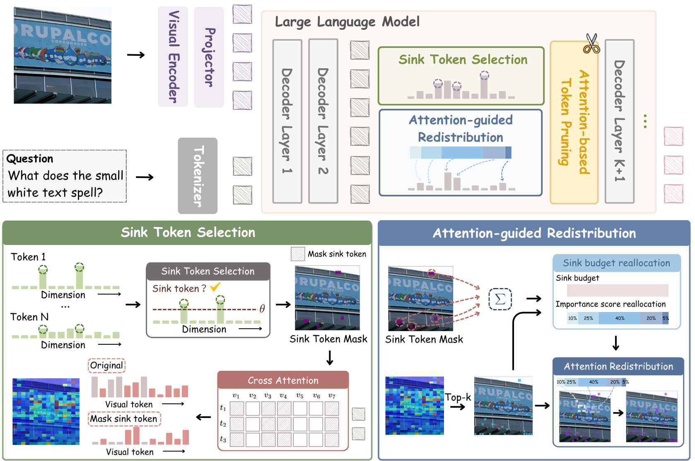

# Sink-aware Text-guided Attention Redistribution for Efficient MLLMs

*A training-free, plug-and-play method that detects sink tokens and redistributes their attention budget to text-relevant visual tokens for more reliable token pruning in multimodal large language models.*

[](https://github.com/intcomp/attention-bias)
[](https://arxiv.org/abs/2508.17807v2)

## 👁️ Overview



Multimodal large language models (MLLMs) often rely on attention scores to decide which visual tokens to keep. In practice, those scores can be distorted by **attention sinks** and positional bias, causing pruning methods to preserve uninformative tokens while dropping useful ones.

This repository studies that failure mode and introduces **sink-aware text-guided attention redistribution**, a lightweight add-on for attention-based pruning. The method:

- detects visual **sink tokens** that absorb disproportionate attention mass,
- estimates **text-to-visual importance** from question-conditioned attention,
- redistributes the sink-token budget to informative non-sink visual tokens before top-k pruning,
- works as a **training-free** enhancement for multiple pruning pipelines.

The current codebase contains integrations for **FastV**, **PyramidDrop** and **SparseVLM**, along with visualization and efficiency tooling.


## ⚙️ Setup

### 🏝️ Environment

1. Clone this repository.

```bash
git clone https://github.com/danzel-crazy/Sink_attention_redistribution.git
```

2. Install the required environments for the target baseline you want to evaluate.

The repository combines several pruning pipelines with different dependency stacks. In general, you will need:

- Python 3.10+
- PyTorch 2.0+
- CUDA 11.8+

For baseline-specific setup details, refer to:

- [`FastV/README.md`](FastV/README.md)
- [`PyramidDrop/README.md`](PyramidDrop/README.md)
- [`SparseVLMs/README.md`](SparseVLMs/README.md)

### 📦 Model

Most evaluation scripts assume **LLaVA-1.5 7B** checkpoints by default, with checkpoint paths controlled through environment variables such as `CKPT` and `CKPT_DIR`.

Typical defaults used in this repo include:

- `liuhaotian/llava-v1.5-7b`
- `llava-hf/llava-1.5-7b-hf`

### 📊 Data

The supported benchmarks include:

- `GQA`
- `MMBench`
- `MMBench-CN`
- `MME`
- `MMVet`
- `POPE`
- `ScienceQA`
- `TextVQA`
- `VizWiz`
- `VQAv2`

## 📋 Evaluation

The core sink-aware redistribution logic is implemented in:

- [`cross_attention_sink_redistribution/sink_tokens.py`](cross_attention_sink_redistribution/sink_tokens.py)
- [`cross_attention_sink_redistribution/cross_attention.py`](cross_attention_sink_redistribution/cross_attention.py)
- [`cross_attention_sink_redistribution/attention_redistribution.py`](cross_attention_sink_redistribution/attention_redistribution.py)

LLaVA-style integrations for patched baselines are under:

- [`cross_attention_sink_redistribution_llava/`](cross_attention_sink_redistribution_llava/)
- [`cross_attention_sink_redistribution_llava_sparsevlm/`](cross_attention_sink_redistribution_llava_sparsevlm/)

### Baseline Evaluation Entrypoints

We provide wrapper scripts to run each integrated pruning family across benchmarks:

```bash
bash scripts/run_fastv.sh
bash scripts/run_pdrop.sh
bash scripts/run_sparsevlm.sh
bash scripts/run_himap.sh
bash scripts/run_tokencarve.sh
```

These wrappers iterate over multiple benchmarks and rely on environment variables such as `CKPT_DIR`, `DATASET_DIR`, `WEIGHT`, and `TAG`.

### Sink-aware Cross Evaluation

For the redistribution-enabled variants, use the cross-attention scripts under:

- `scripts/FastV/cross/`
- `scripts/FastV/pre_visual/`
- `scripts/FastV/pre_visual_cross/`
- `scripts/PyramidDrop/cross_128/`
- `scripts/SparseVLMs/cross/`

Typical knobs include:

- `REDISTRIBUTION_STRATEGY`
- `REDISTRIBUTION_SOFTMAX_MODE`
- `RECEIVER_TOKEN_COUNT`
- `RETAINED_TOKENS`
- `FASTV_K`
- `FASTV_R`
- `LAYER_LIST`
- `IMAGE_TOKEN_RATIO_LIST`

Example commands:

```bash
CUDA_VISIBLE_DEVICES=0 bash scripts/FastV/cross/mme_hf.sh
CUDA_VISIBLE_DEVICES=0 bash scripts/PyramidDrop/cross_128/mme.sh
CUDA_VISIBLE_DEVICES=0 bash scripts/SparseVLMs/cross/128/MME.sh
```

### Efficiency Measurement

Efficiency instrumentation is documented in [`efficiency/README.md`](efficiency/README.md). Example usage:

```bash
conda activate V2Drop
bash scripts/efficiency/run_family_a.sh 0

conda activate fastv
bash scripts/efficiency/run_family_b.sh 0
```

To aggregate results:

```bash
python -m efficiency.aggregate
```

## Visualization

The [`visualization/`](visualization/) directory contains the offline analysis tools for inspecting
how sink-aware redistribution changes visual-token selection. The workflow is split into two steps:

1. **Capture snapshots** during evaluation, saving the prune-layer hidden states, sink-token scores,
   self-attention, text-to-visual cross-attention, redistributed attention, and final kept tokens.
2. **Render figures** from those saved snapshots without rerunning model inference.

The main capture scripts are:

- [`visualization/capture_fastv_single_case.py`](visualization/capture_fastv_single_case.py)
- [`visualization/capture_fastv_multiple_cases.py`](visualization/capture_fastv_multiple_cases.py)
- [`visualization/capture_pdrop_multiple_cases.py`](visualization/capture_pdrop_multiple_cases.py)

Wrapper scripts for common workflows are provided in [`visualization/script/`](visualization/script/):

- `run_fastv_multiple_cases.sh`
- `run_fastv_multiple_cases_pre_visual.sh`
- `run_pdrop_multiple_cases.sh`
- `run_combined_collection.sh`

Typical capture commands:

```bash
BENCHMARK=pope CASES=1-10 \
./visualization/script/run_fastv_multiple_cases.sh 0

BENCHMARK=pope CASES=1-10 \
./visualization/script/run_fastv_multiple_cases_pre_visual.sh 0

BENCHMARK=pope CASES=1-10 \
./visualization/script/run_pdrop_multiple_cases.sh 0
```

Snapshots are written under `visualization/snapshots/`, and rendered outputs are typically written
under `visualization/output/`.

The main renderers include:

- [`visualization/combined_fastv_collection.py`](visualization/combined_fastv_collection.py):
  generates per-case summary collections from a snapshot.
- [`visualization/cross_attention_visualize.py`](visualization/cross_attention_visualize.py):
  overlays pre-visual, in-decoder, and redistributed attention maps on the image.
- [`visualization/sink_token_visualizations.py`](visualization/sink_token_visualizations.py):
  analyzes sink-token scores, positions, and hidden-state patterns.

Example rendering command:

```bash
python -m visualization.combined_fastv_collection \
  --snapshot visualization/snapshots/textvqa/pre_visual \
  --out-dir visualization/output/textvqa/pre_visual
```

The generated collections can include:

- top-k overlays for baseline and redistributed attention,
- sink-token positions and sink-budget summaries,
- receiver-weight heatmaps,
- kept-token visualizations,
- hidden-state plots for the highest-ranked redistributed tokens.

Additional usage notes and case-selection details are documented in
[`visualization/docs.md`](visualization/docs.md).


## 🔖 Citation

If you use this repository, please cite the current paper metadata tracked in the repo:

```bibtex
@article{zhao2026attention,
  title={Attention Debiasing for Token Pruning in Vision--Language Models},
  author={Zhao, Kai and Yuan, Wubang and Lin, Yuchen and Ruan, Liting and Lu, Xiaofeng and Fan, Deng-Ping and Cheng, Ming-Ming and Zeng, Dan},
  journal={arXiv preprint},
  year={2026}
}
```
